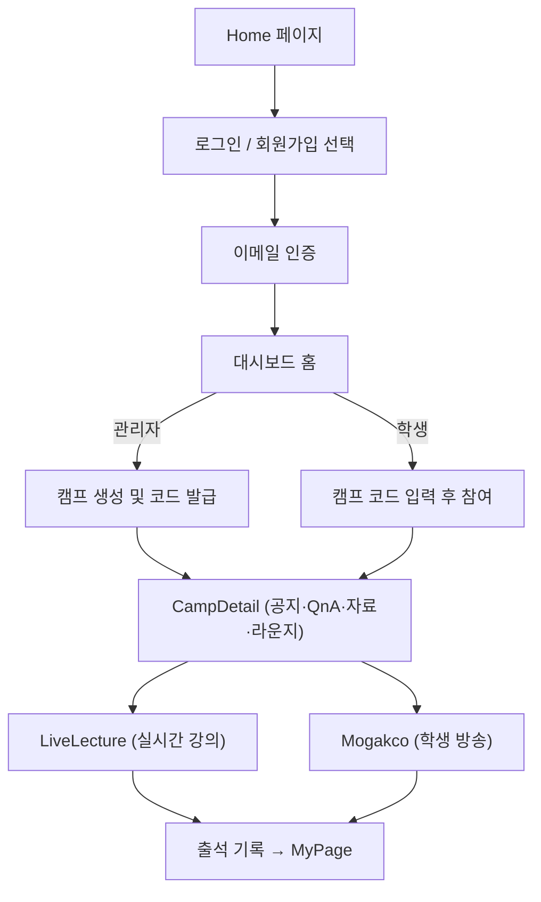
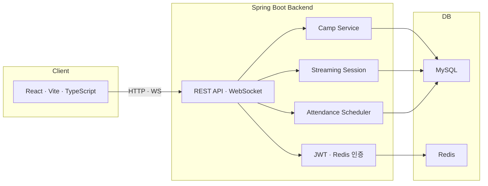

# 🏕️ devCampHub (25.09.15 ~ 진행 중)

> **출석 · 소통 · 방송을 한 곳에서**
> 캠프 운영자가 실시간 강의와 출석을 관리하고,
> 학생이 모각코(온라인 스터디)에 참여할 수 있는 서비스

---

# 💡 부트캠프를 하면서 겪었던 불편한 점

부트캠프를 진행하면서 느낀 가장 큰 어려움은
학습 관리 도구들이 각각 분리되어 있었다는 점이었습니다.

- 🕓 출석은 별도의 외부 사이트에서 체크해야 했고,

- 💬 소통은 Slack이나 Discord 등 외부 메신저에서 이루어졌으며,

- 🎥 방송 및 실시간 강의는 Zoom 같은 화상 프로그램을 따로 실행해야 했습니다.

이처럼 기능이 여러 플랫폼으로 분산되어 있다 보니,
참여자 입장에서는 매일 여러 프로그램을 오가며 로그인하고, 알림을 놓치고, 기록이 흩어지는 불편함이 있었습니다.
관리자 입장에서도 출석, 강의, 공지, 질의응답을 각각 다른 도구로 관리해야 하므로 운영 효율이 떨어졌습니다.

---

# 💭 이런 문제를 해결하기 위해

> “출석부터 방송, 채팅까지 한 곳에서 해결할 수 없을까?”
> 이 질문에서 devCampHub가 시작되었습니다.

- 하나의 웹 플랫폼 안에서
- 출석 관리, 실시간 방송, 채팅, 캠프 생성 및 운영을 통합 관리할 수 있고,
- 별도 프로그램 설치 없이 브라우저만으로 캠프를 운영할 수 있습니다.

결과적으로 devCampHub는
캠프 운영자에게는 효율적인 관리 환경을,
참여자에게는 단순하고 직관적인 학습 경험을 제공하는 플랫폼을 목표로 하고 있습니다.

--- 

## 📘 1. 소개

**devCampHub**는
온라인 캠프 환경에서 필요한 기능 —
**회원가입, 캠프 생성·참여, 실시간 방송, 채팅, 출석 관리** — 를
브라우저 하나로 통합 제공하는 서비스입니다.

* **관리자(Admin)** → 캠프 생성, 강의 송출, 학생 출석 확인
* **학생(Student)** → 캠프 참여, 실시간 소통, 모각코 방송 참여

---

## 🎯 2. 목표

| 구분           | 목표 내용                                       |
| ------------ | ------------------------------------------- |
| 🎥 실시간 방송    | 관리자가 WebRTC/HLS 기반으로 강의를 송출하고, 학생이 참여할 수 있음 |
| 💬 캠프 채널별 채팅 | 공지, Q&A, 자료공유, 라운지, 공부질문 등 캠프별 채널 제공        |
| ⏱ 자동 출석 집계   | 방송 누적 시간을 기반으로 출석 여부 자동 판정                  |
| 🧭 모각코       | 학생이 직접 방송을 켜서 공부 세션 공유                      |
| 🧩 통합 대시보드   | 캠프, 출석, 방송, 채팅을 한 페이지에서 관리                  |

---

## 🔁 3. 서비스 흐름

### 🖥 프론트엔드 플로우

### ⚙️ 백엔드 아키텍처

---

## 🧱 4. 기술 스택

| 영역                 | 기술                                                      |
| ------------------ | ------------------------------------------------------- |
| **Frontend**       | React (Vite), TypeScript, React Router, CSS             |
| **Backend**        | Spring Boot 3, Spring Data JPA, Spring Security, Lombok |
| **DB / Cache**     | MySQL, Redis (TTL, 인증코드 관리)                             |
| **Realtime**       | WebSocket, STOMP                                        |
| **Auth**           | JWT + 이메일 인증 (SMTP)                                     |
| **Infra / Test**   | MySQL, Postman, Swagger(OpenAPI)                 |
| **Build / Deploy** | Gradle, Docker, CI/CD(예정)                               |

---

## 🚧  5. ERD 설계

[ERD 설계](https://github.com/TaeDongUm/devCampHub/wiki/ERD)

 

---

## 📊 6. 현재까지 구현 현황

| 기능                  | 구현 여부 | 비고                  |
| ------------------- | ----- | ------------------- |
| 회원가입 (관리자 / 학생)     | ✅ 완료  | 이메일 인증 포함 (3분 제한)   |
| 로그인 / JWT 발급        | ✅ 완료  | 토큰 저장 및 인증 처리       |
| 캠프 생성 / 조회 / 참여     | ✅ 완료  | 초대 코드 자동 생성         |
| 캠프 권한 분리            | ✅ 완료 | 관리자 / 학생 역할 구분      |
| 실시간 채팅 (채널별)        | ✅ 완료 | 링크 감지, 코드블럭, 파일 첨부  |
| 실시간 강의 UI (관리자)     | 🚧 구현 중 | WebRTC/HLS 연동 예정    |
| 모각코 방송 (학생)         | ✅ 완료 | 방송 시작/종료, 썸네일 UI    |
| 출석 기록 UI            | ✅ 완료  | 누적 시간 표시, 1일 집계 예정  |
| 마이페이지 / 설정          | ✅ 완료  | 프로필, 트랙, 블로그 수정 가능  |
| 이메일 TTL 관리 (Redis)  | ⚙️ 예정 | Redis TTL 적용 예정     |
| 방송 저장 / 아카이브        | ⚙️ 예정 | 클라우드 연동 예정          |
| 관리자 출석 대시보드         | ⚙️ 예정 | 통계 시각화 예정           |
| 실시간 동기화 (WebSocket) | ⚙️ 예정 | 현재는 LocalStorage 기반 |
| CI/CD 및 배포          | ⚙️ 예정  | 계획 단계               |

기능은 추가될 수 있습니다.
---

## 🚀 7. 앞으로의 계획

| 단계  | 내용                       | 설명                                |
| --- | ------------------------ | --------------------------------- |
| 1️⃣ | **WebSocket / Redis 통합** | 실시간 채팅 및 세션 상태 서버 연동              |
| 2️⃣ | **WebRTC 방송 완성**         | 관리자 강의 / 학생 방송 실시간 송출             |
| 3️⃣ | **자동 출석 스케줄러**           | 23:59 배치 출석 집계 (Spring Scheduler) |
| 4️⃣ | **아카이브 기능**              | 방송 종료 후 녹화본 및 썸네일 저장              |
| 5️⃣ | **대시보드 고도화**             | 캠프별 출석률, 시청자 수 시각화                |
| 6️⃣ | **Docker + CI/CD**       | AWS 배포, GitHub Actions 자동화        |
| 7️⃣ | **UX 개선**                | 반응형 레이아웃, 애니메이션, 접근성 향상           |

---

